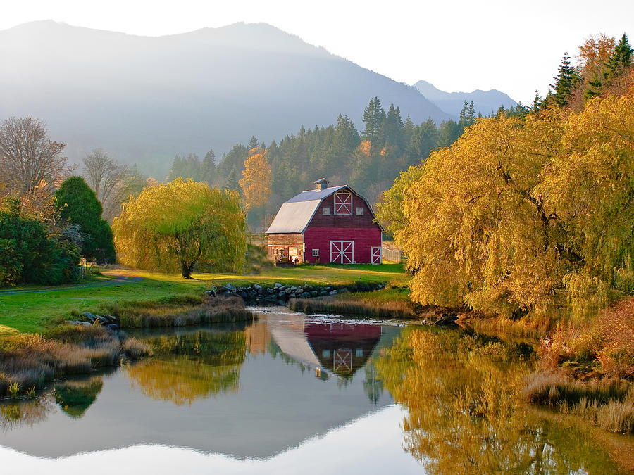

# Barn

Rust framework for 2D game development. Heavily inspired by XNA/Monogame/LibGDX.

## Technologies

This framework is currently primarily a wrapper around SDL2.

### Future Roadmap

If this project continues, it should move to the following:

- Rename to Silo.
- An actual graphics API (OpenGL/Vulkan)
- Sprite and ModelBatch for 2D/3D rendering.
- Font rendering.
- `winit` for native Rust window handling and input.
- Cross-platform support
    - Windows
    - Linux
    - Mac
    - Web
- TODO: Investigate cross-platform sound library.

## Features

- CLI for rapidly creating new projects.
- Provides game loop.
- Math library (Vector2-3-4, Matrix3-4, Quats, tweening/animation)
- Sprite/Model Animation
- Font/Shape rendering
- Audio helper libraries
- Content loading
    - Textures
    - Models (Obj, FBX, ???) 
    - Audio
    - Sprite animations
    - 3d animations
    - CustomResources
    - Video???
- BasicShaders (mostly to get started drawing/animating)
- Basic collision.
    - BoundingBox, Circle Sphere.
    - Point, Line, Triangle/Surface
    - Ellipsoid/Swept-Collision

